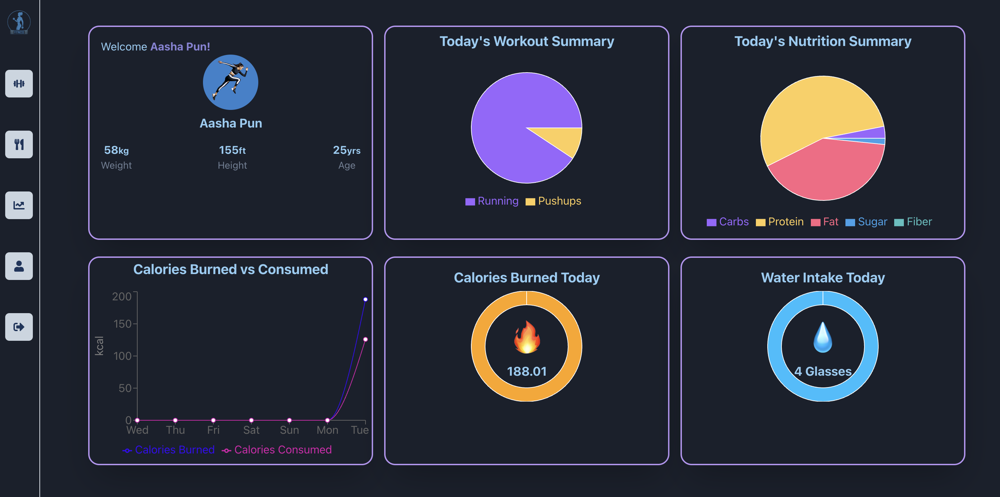
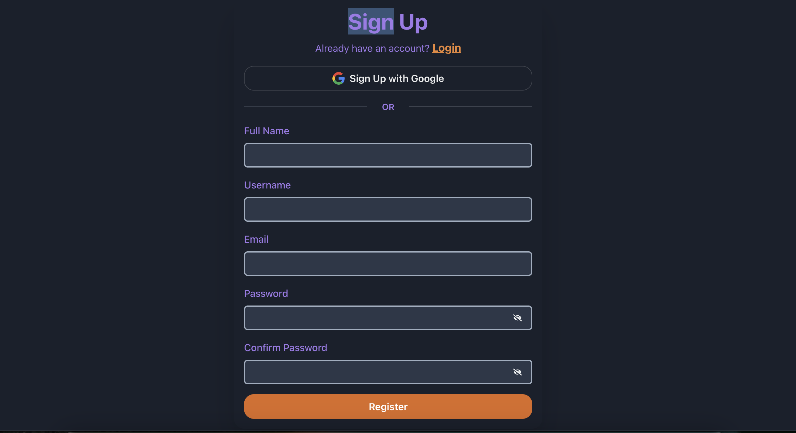
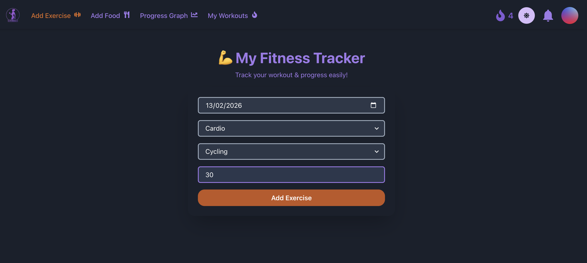
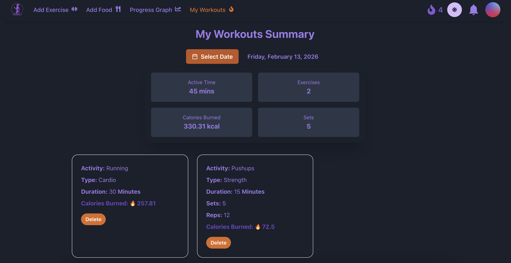
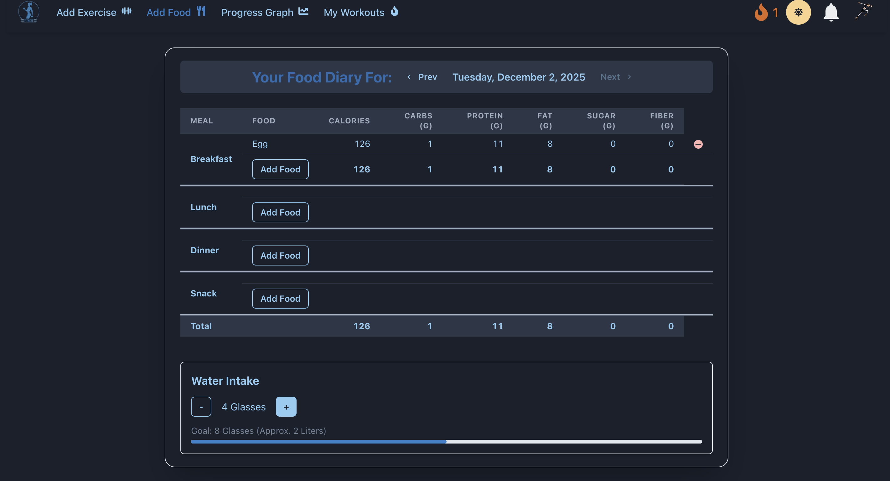
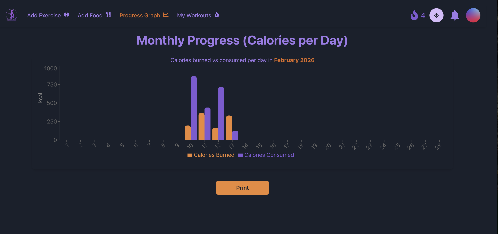

# 🏋️ Fitness Tracker Web App — MERN Stack

Fitness Tracker is a full-stack MERN web application that helps users to log the workouts, track the nutrition with real time Spoonacular API and track the progress over time.

🌐 **Live Site:** https://fitnesstracker-frontend-lgz6.onrender.com  

---

## ✨ Features

### 🔐 Authentication
- User Signup & Login (JWT)
- Email verification on signup
- Forgot Password + Reset Link (Nodemailer + Brevo)
- Secure password hashing using bcrypt

---

## 🏋️ Workouts Module
- Add workouts with:
  - Type  
  - Duration  
  - Date  
- Automatic **calorie burn calculation** using MET values
- Daily & total calorie burned tracking
- **Workout streak system** with sound + reward modal

---

## 🥗 Nutrition Tracking
- Search foods using **Spoonacular API**
- Fetch:
  - Calories  
  - Protein / Carbs / Fat  
  - Serving size + accurate units  
- Add meals to Breakfast, Lunch, Dinner, Snacks
- Daily calorie consumed tracking

---

## 💧 Water Intake Tracking 
- Add glasses or mL of water
- Stored in a **separate MongoDB model**
- Daily water progress bar

---

## 📊 Data Visualization
- **7-day  calorie burned vs consumed line chart**
- **Monthly calorie comparison bar chart**
- Pie chart for daily macros
- Progress stats for:
  - Workouts  
  - Nutrition  
  - Water  
  - Streak consistency  

---

## 🧭 Dashboard
- Total water intake
- Workout streak count
- Workout and Nutrition Summary
- 7 days calories burned & consumed

---

## 🛠️ Tech Stack

### Frontend
- React (Vite)
- Chakra UI
- Axios
- React Router DOM
- Recharts
- use-sound

### Backend
- Node.js + Express
- MongoDB Atlas + Mongoose
- Nodemailer + Brevo
- Spoonacular API
- JWT Authentication
- bcrypt
- CORS, dotenv, validator

---

## 📸 Screenshots

## 🔮 Future Enhancements

- AI-powered workout plans
- AI diet suggestions
- Before/after progress photos
- Premium plan + payment integration

---

## 🙏 Acknowledgments
Built with ❤️ by Aasha Pun

